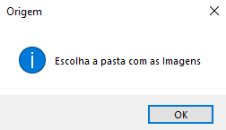
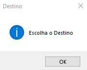

# 📸 Batch Image Collage Tool

> Ferramenta de automação em Python para processamento de imagens em lote. 
> Varre diretórios de forma recursiva (incluindo subpastas), centraliza os arquivos e gera uma composição visual única (colagem).


---

## 🎯 Problema e Solução
**O Problema:** Organizar ou visualizar centenas de fotos espalhadas em diversas subpastas é trabalhoso.  
**A Solução:** Este script automatiza a coleta de arquivos `.jpg` em toda a árvore de diretórios selecionada, cria um ambiente temporário de processamento e gera um arquivo final consolidado, limpando os resíduos depois.

---

## ⚙️ Funcionalidades
* **Busca Recursiva:** Utiliza `glob` para encontrar arquivos mesmo dentro de pastas aninhadas.
* **Gestão de Arquivos:** Uso de `shutil` e `os` para criar buffers temporários e limpar o disco após a execução.
* **Interface Gráfica (GUI):** Utiliza `tkinter` para que o usuário final possa selecionar pastas sem usar linha de comando.

---

## 📸 Como Funciona
O script guia o usuário através de diálogos nativos do sistema operacional:

| 1. Seleção de Origem | 2. Seleção de Destino |
|:---:|:---:|
|  |  |
| *Script varre esta pasta e todas as subpastas* | *Onde o arquivo final será salvo* |

---

## 🚀 Como Executar

1. Instale as dependências:
   ```bash
   pip install -r requirements.txt
   ```

2. Execute o script:
    ```bash
   python main.py
   ```

   

